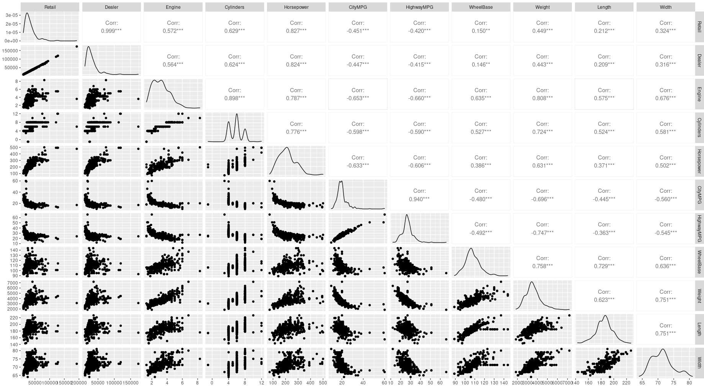

# !diagnostics off

We first delete the R objects left in memory:

rm(list = ls())

Then we load the needed packages:

```{r}
library(dplyr)
library(kableExtra)
library(HSAUR3)
library(readr)
```

Next, we retrive the data:
```{r}
bicing = read_csv("cars2004.csv")
spec(bicing)
```

Now, it is useful to visualize the data in a tabular fashion with the Kable library:
```{r}
bicing[1:5 ,] %>%
kbl(caption = "Cars models") %>%
kable_classic(full_width = F, html_font = "Cambria")

```


Now it can be useful to visualize some selected rows and columns:

```{r}
bicing%>% slice(c(10,25)) %>% 
                kbl() %>%
                 kable_classic(full_width = F, html_font = "Cambria")
```
Before proceeding in the exploration of the data, it is important to understand the quality of the dataset, looking for example if there are NA value.
We decided to look for the sum  and the mean of the NA values in each column.

```{r}

print("Number of NA values in each column:")
for(name in names(bicing)){
  print(paste(name,  ": ", sum(is.na(bicing[, name]))))
}

print("--------------------------------------------------------------------")

print("Mean of the NA values in each column:")
for(name in names(bicing)){
  print(paste(name, ": ", mean(is.na(bicing[, name]))))
}
```
We observe that there are several columns having NA values.
Some of them are categorical variable, while other are numerical one.
We need to treat it differently.
One possible option would be to replace the NA values in the categorical variables with the most used value in that specific column (either 0 or 1) applying a sort of "majority voting".
While for the numerical variable, we can simply substitute the NA values with the mean of the column.


```{r}
# we retrieve for the categorical variable having NA values the most used
# value between 0 and 1.

value <- tail(names(sort(table(bicing$Sports))), 1)
bicing$Sports[is.na(bicing$Sports)] <- value


# now we substitute with the mean the NA values in the numerical variable

citympg_mean <- mean(bicing$CityMPG, na.rm = TRUE)
highwaympg_mean <- mean(bicing$HighwayMPG, na.rm = TRUE)
weight_mean <- mean(bicing$Weight, na.rm = TRUE)
wheelbase_mean <- mean(bicing$WheelBase, na.rm = TRUE)
lenght_mean <- mean(bicing$Length, na.rm = TRUE)
width_mean <- mean(bicing$Width, na.rm = TRUE)


bicing$CityMPG[is.na(bicing$CityMPG)] <- citympg_mean
bicing$HighwayMPG[is.na(bicing$HighwayMPG)] <- highwaympg_mean
bicing$Weight[is.na(bicing$Weight)] <- weight_mean
bicing$WheelBase[is.na(bicing$WheelBase)] <- wheelbase_mean
bicing$Length[is.na(bicing$Length)] <- lenght_mean
bicing$Width[is.na(bicing$Width)] <- width_mean

```
Let's visualize again the data without the NA values

```{r}
bicing[1:5,] %>%
kbl(caption = "Cars models") %>%
kable_classic(full_width = F, html_font = "Cambria")
```

The goal of this task is to apply PCA to the given dataset.
However we observe that seven features are of binary type, while PCA fit naturally with continuous variable.
Therefore we decide to discard the binary variables and continue working only with the continuous one.

```{r}

keeps <- c("Retail", "Dealer", "Engine", "Cylinders", "Horsepower", "CityMPG", "HighwayMPG", "WheelBase", "Weight", "Length", "Width")
bicing <- bicing[keeps]

```


It is useful to visualize the data, utilizing for example a scatter plot.
However our data has several categorical variables, defining the type to which each car belongs to.
Therefore, before plotting the scatterplot, we exclude such variables, focusing on the numerical one.
Together with the scatterplot of the numerical variable, using the ggplot and GGally libraries, we can also compute the correlation matrix.

```{r}

library(ggplot2)
library(GGally)

x11(width = 20, height = 15)
ggpairs(bicing)

Sys.sleep(10)
```


From the scatter plot, it seems like there are several outliers that needs to be handled in order to improve the quality of the dataset.
LA FUNZIONE PRATICAMENTE GUARDA A TUTTE LE COLONNE CON VALORI NUMERICI E USANDO LA FUNZIONE BOXPLOT CHE RESTITUISCE LE STATISTICHE DEL DATASET, PRENDE I PUNTI CHE SONO FUORI DALL'INTERQUANTILE RANGE E LI METTE UGUALI A NA
```{r}

library(dplyr)
library(purrr)

# first we copy the original dataframe

pp_bicing <- data.frame(bicing)

outlierreplacement <- function(dataframe){
   dataframe %>%          
           map_if(is.numeric, ~ replace(.x, .x %in% boxplot.stats(.x)$out, NA)) %>%
           bind_cols 
}

na_bicing <- outlierreplacement(pp_bicing)

```

The outliers have been transformed into NA values. 
As we did before, we can transform such values into the mean of the columns to which they belong.

First we have to check another time the columns in which we have NA values,
we use the keeps variable to avoid looking at the categorical variables.
This has to be done because otherwise a lot of values in the categorical variable are identified as 'outliers' even though in such columns only the values 0 and 1 are assigned.

```{r}

#keeps <- c("Retail", "Dealer", "Engine", "Cylinders", "Horsepower", "CityMPG", "HighwayMPG", "WheelBase", "Weight", "Length", "Width")

print("Number of NA values in each column:")
for(name in names(na_bicing)){
  print(paste(name,  ": ", sum(is.na(na_bicing[, name]))))
}

print("--------------------------------------------------------------------")

print("Mean of the NA values in each column:")
for(name in names(na_bicing)){
  print(paste(name, ": ", mean(is.na(na_bicing[, name]))))
}
```
After this, we can substitute the NA values as explained above.

```{r}
# now we substitute with the mean the NA values in the numerical variable

retail_mean <- mean(na_bicing$Retail, na.rm = TRUE)
dealer_mean <- mean(na_bicing$Dealer, na.rm = TRUE)
engine_mean <- mean(na_bicing$Engine, na.rm = TRUE)
cylinders_mean <- mean(na_bicing$Cylinders, na.rm = TRUE)
horsepower_mean <- mean(na_bicing$Horsepower, na.rm = TRUE)

citympg_mean <- mean(na_bicing$CityMPG, na.rm = TRUE)
highwaympg_mean <- mean(na_bicing$HighwayMPG, na.rm = TRUE)
weight_mean <- mean(na_bicing$Weight, na.rm = TRUE)
wheelbase_mean <- mean(na_bicing$WheelBase, na.rm = TRUE)
lenght_mean <- mean(na_bicing$Length, na.rm = TRUE)
width_mean <- mean(na_bicing$Width, na.rm = TRUE)

na_bicing$Retail[is.na(na_bicing$Retail)] <- retail_mean
na_bicing$Dealer[is.na(na_bicing$Dealer)] <- dealer_mean
na_bicing$Engine[is.na(na_bicing$Engine)] <- engine_mean
na_bicing$Cylinders[is.na(na_bicing$Cylinders)] <- cylinders_mean
na_bicing$Horsepower[is.na(na_bicing$Horsepower)] <- horsepower_mean

na_bicing$CityMPG[is.na(na_bicing$CityMPG)] <- citympg_mean
na_bicing$HighwayMPG[is.na(na_bicing$HighwayMPG)] <- highwaympg_mean
na_bicing$Weight[is.na(na_bicing$Weight)] <- weight_mean
na_bicing$WheelBase[is.na(na_bicing$WheelBase)] <- wheelbase_mean
na_bicing$Length[is.na(na_bicing$Length)] <- lenght_mean
na_bicing$Width[is.na(na_bicing$Width)] <- width_mean
```


Let's see the updated dataset:

```{r}
na_bicing[1:5,] %>%
kbl(caption = "Cars models") %>%
kable_classic(full_width = F, html_font = "Cambria")
```

To see the effects that the elimination of the outliers has produced let's plot a box plot for each variable.

```{r}
boxplot(na_bicing$Retail, na_bicing$Dealer, na_bicing$Engine,
        na_bicing$Cylinders, na_bicing$Horsepower, na_bicing$CityMPG,
        names=c("Retail", "Dealer", "Engine", "Cylinders", "Horsepower", 
                "CityMPG"))
```
```{r}
boxplot(na_bicing$HighwayMPG, na_bicing$WheelBase,
        na_bicing$Weight, na_bicing$Length, na_bicing$Width, 
        names=c("HighwayMPG","Wheelbase", "Weight", "Length", "Width"))
```


## PCA


Now that the pre-processing phase has been completed, we can start applying PCA in order to reduce the dimensionality of the dataset.

The first thing to observe is that the columns work on very different scales, therefore, it is necessary to extract the PCs from the correlation matrix R.
So that we don't need to center the data set.


```{r}

### PCA

bicing_pca <- princomp(na_bicing, cor=TRUE)

```


So we obtain the list of the coefficients defining the PCs: PC scores etc.

```{r}
str(bicing_pca)
```

Now it is useful to observe the loading vector for the first PC

```{r}
l1 <- bicing_pca$loadings[, 1]
```


The vector has to be orthonormal, we can check this computing the dot product of the vector with itself:

```{r}
l1%*%l1
```


And now we can check that all the loading vectors are orthogonal between each other, computing the loading vector for the second PC and then appliyng the dot product with the loading vector computed above.

```{r}
l2 <- bicing_pca$loadings[, 2]

l1%*%l2
```


### Rescaled Coefficients

Now it is useful to rescale the loadings, so that the coefficients for the most important components are larger than those for less important one.
In order to rescale the loadings we use the standard deviations of the principal components.

```{r}
rescaledl1 <- l1 * bicing_pca$sdev[1]
rescaledl1
```


### Explaned Variance

First we print the summary function, to obtain for each component it's standard deviation, the proportion of variance explained and the cumulative proportion of variance

```{r}
summary(bicing_pca)
```

The plot for the proportion of variance explained

```{r}

# compute the percentage of variance explained for each component
pr.var <- bicing_pca$sdev^2
pve <- pr.var/sum(pr.var)


plot(pve, xlab="Principal Component",
ylab="Proportion of Variance Explained",
ylim=c(0,1),type='b')
```


Then we can obtain the cumulative proportion of variance

```{r}

plot(cumsum(pve), xlab="Principal Component",
ylab="Cumulative Proportion of Variance Explained",
ylim=c(0,1),type='b')
```


### Choosing the number of components


Now we should choose the number of components with which we want to explain our data.
To do so it is useful to understand which are the components that retain the majority of the variability.
A good graphical indicator is the screeplot, which plots the variance explaind by each component.
To do such plot we load the factoextra library.

```{r}
library(factoextra)
```


```{r}
fviz_eig(bicing_pca, addlabels = TRUE, ylim = c(0, 70))
```


It is useful to use the get_pca_var() function, which provides a list of matrices containing all the results for the active variables (coordinates, correlation between variables and axes, squared cosine and contributions).

```{r}
var <- get_pca_var(bicing_pca)
var
```


### Loading Plot

The correlation between a variable and a principal component (PC) is used as the coordinates of the variable on the PC. The representation of variables differs from the plot of the observations: The observations are represented by their projections, but the variables are represented by their correlations


```{r}
# Coordinates of variables
head(var$coord, 4)
```

Now we plot the correlation circle to show it better:

```{r}
fviz_pca_var(bicing_pca, col.var = "black", labelsize = 2.5, repel = TRUE)
```

The plot above is also known as variable correlation plots. It shows the relationships between all variables. It can be interpreted as follow:

- Positively correlated variables are grouped together.

- Negatively correlated variables are positioned on opposite sides of the plot origin (opposed quadrants).

- The distance between variables and the origin measures the quality of the variables on the factor map. Variables that are away from the origin are well represented on the factor map.

#### Quality of representation


The quality of representation of the variables on factor map is called cos2 (square cosine, squared coordinates).
We can use the corrplot package to visualize the cos2


```{r}
head(var$cos2, 4)
```


```{r}
library("corrplot")
corrplot(var$cos2, is.corr=FALSE)
```

It’s also possible to create a bar plot of variables cos2 using the function fviz_cos2

```{r}
# Total cos2 of variables on Dim.1 and Dim.2
fviz_cos2(bicing_pca, choice = "var", axes = 1:2)
```


- A high cos2 indicates a good representation of the variable on the principal component. In this case the variable is positioned close to the circumference of the correlation circle.

- A low cos2 indicates that the variable is not perfectly represented by the PCs. In this case the variable is close to the center of the circle.

For a given variable, the sum of the cos2 on all the principal components is equal to one.

If a variable is perfectly represented by only two principal components (Dim.1 & Dim.2), the sum of the cos2 on these two PCs is equal to one. In this case the variables will be positioned on the circle of correlations.

For some of the variables, more than 2 components might be required to perfectly represent the data. In this case the variables are positioned inside the circle of correlations.


It’s possible to color variables by their cos2 values using the argument col.var = "cos2".

- variables with low cos2 values will be colored in “white”
- variables with mid cos2 values will be colored in “blue”
- variables with high cos2 values will be colored in red


```{r}
# Color by cos2 values: quality on the factor map
fviz_pca_var(bicing_pca, col.var = "cos2",
             gradient.cols = c("#00AFBB", "#E7B800", "#FC4E07"), 
             repel = TRUE, labelsize = 2.5 # Avoid text overlapping
             )
```


### Contributions of variables to PCs

The contributions of variables in accounting for the variability in a given principal component are expressed in percentage.

- Variables that are correlated with PC1 (i.e., Dim.1) and PC2 (i.e., Dim.2) are the most important in explaining the variability in the data set.

- Variables that do not correlated with any PC or correlated with the last dimensions are variables with low contribution and might be removed to simplify the overall analysis.


```{r}
head(var$contrib, 4)
```

It’s possible to use the function corrplot() to highlight the most contributing variables for each dimension:


```{r}
corrplot(var$contrib, is.corr=FALSE)  
```


The function fviz_contrib() can be used to draw a bar plot of variable contributions.


```{r}
# Contributions of variables to PC1
fviz_contrib(bicing_pca, choice = "var", axes = 1, top = 10)
```

```{r}
# Contributions of variables to PC2
fviz_contrib(bicing_pca, choice = "var", axes = 2, top = 10)
```


The red dashed line on the graph above indicates the expected average contribution.
For a given component, a variable with a contribution larger than this cutoff could be considered as important in contributing to the component.

Now we can plot again the correlation circle, highlighting the most important variables.

```{r}
fviz_pca_var(bicing_pca, col.var = "contrib",
             gradient.cols = c("#00AFBB", "#E7B800", "#FC4E07"),
             labelsize = 2
             )
```


### Principal Component scores

The PC scores are the values of each PCs (linear combination of the original variables) evaluated in the data set.


```{r}
head(predict(bicing_pca)) %>%
  kbl(caption = "PCA scores") %>%
  kable_classic(full_width = F, html_font = "Cambria")
```


The PCs should be uncorrelated


```{r}
cor(bicing_pca$scores) %>%
  kbl(caption = "PCA scores") %>%
  kable_classic(full_width = F, html_font = "Cambria")
```

Now we can try to visualize the scatter plot between the score of the PC1, together with one the variables of the dataset, like for example the length.


```{r}
pc1.scores <- bicing_pca$scores[,1]
plot(na_bicing$Width, pc1.scores)
```

OSSERVAZIONI


Now, given the scores of each entry of the dataset, it is possible to visualize the Score Plot, which shows clusters of athletes based on their similarity.

```{r}
rbind(bicing_pca$scores[,1], bicing_pca$scores[,2])
```

Due to the large amount of data points at disposal, it would be impossible to label each point in the graph.
Therefore, we can use the supplementary categorical variable, represented by the model type of the car, to color each point.
Before doing so, it is necessary to collapse all the binary variable regarding the model type, in one labelling variable.


```{r}

#Sports	SUV	Wagon	Minivan	Pickup	AWD	RWD

bicing_lab = read_csv("cars2004.csv")


# need to remove again the NA values
value <- tail(names(sort(table(bicing_lab$Sports))), 1)
bicing_lab$Sports[is.na(bicing_lab$Sports)] <- value

model <- c()

for(i in 1:nrow(bicing_lab)){
  
  if(bicing_lab[i, "Sports"] == 1){
    model <- c(model, "Sport")
  }
  else if(bicing_lab[i, "SUV"] == 1){
    model <- c(model, "SUV")
    
  }
  else if(bicing_lab[i, "Wagon"] == 1){
    model <- c(model, "Wagon")
  
  }
  else if(bicing_lab[i, "Minivan"] == 1){
    model <- c(model, "Minivan")
  
  }
  else if(bicing_lab[i, "Pickup"] == 1){
    model <- c(model, "Pickup")
  
  }
  else if(bicing_lab[i, "AWD"] == 1){
    model <- c(model, "AWD")
  
  }
  else{
  
    model <- c(model, "RWD")
  }
}

bicing_lab["Model"] <- model
```


```{r}
fviz_pca_ind(bicing_pca,
             geom.ind = "point", # show points only (nbut not "text")
             col.ind = bicing_lab$Model, # color by groups
             palette = c("#D95F02", "#E7298A", "#66A61E", "#A6761D",
                         "#E6AB02", "#666666", "#7570B3"),
             addEllipses = FALSE, # Concentration ellipses
             legend.title = "Models"
             )
```


### Bi-plot

Finally we draw the biplot, which the combination of the PCA score plot, together with the loading plot.


```{r}

#Retail	Dealer	Engine	Cylinders	Horsepower	CityMPG	HighwayMPG	Weight	WheelBase	Length	Width


fviz_pca_biplot(bicing_pca, 
                col.ind = bicing_lab$Model, palette = "jco", 
                addEllipses = FALSE, label = "var",
                col.var = "black", repel = TRUE,
                legend.title = "Models") 
```


Let's another possible version of the biplot

```{r}
fviz_pca_biplot(bicing_pca, 
                # Individuals
                geom.ind = "point",
                fill.ind = bicing_lab$Model, col.ind = "black",
                pointshape = 21, pointsize = 2,
                palette = "jco",
                #addEllipses = TRUE,
                # Variables
                alpha.var ="contrib", col.var = "contrib",
                gradient.cols = "RdYlBu",
                
                legend.title = list(fill = "Models", color = "Contrib",
                                    alpha = "Contrib")
                )
```


